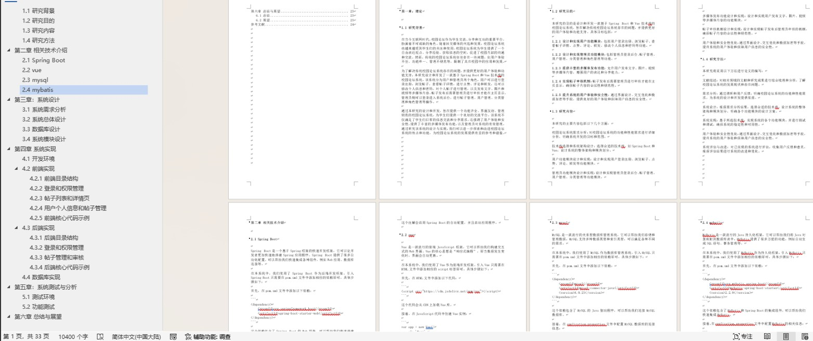

# 校园论坛管理系统

### 9.9￥ 获取完整源码+sql，附赠10000字论文参考，需要加Q：3577148218 ,微信: qszard26
### 有问题，或者需要协助调试运行项目的也可联系
### 更多项目： https://github.com/34426?tab=repositories

## 一、介绍

基于springboot+vue的前后端分离校园论坛管理系统

有两个角色：管理员和用户

1.多功能丰富：系统内置了表白墙、分享墙、买卖墙、综合墙四个板块，用户可以根据自己的需求发布帖子，分享自己的校园生活，丰富了用户的校园经历。

2.热度排行榜：系统针对帖子的热门程度进行排行，将用户感兴趣的内容置于首页，为用户提供更优质的服务。

3.后台管理：管理员可以进入后台管理进行内容管理，类型管理，评论管理和用户管理，从而可以更好地为用户服务，保持平台内容的质量。

4.图片分享：用户可以上传和分享图片，更好地表达自己的校园生活，丰富自己的个人作品和经验分享。

## 二、软件架构

语言：java

前端技术：Vue、 ELementUI

后端技术：SpringBoot、Mybatis-Plus

数据库：MySQL

## 三、系统部分功能页面展示

## 四、附赠10000字论文参考

### 9.9￥ 获取完整源码+sql，附赠10000字论文参考，需要加Q：3577148218 ,微信: qszard26
### 有问题，或者需要协助调试运行项目的也可联系

